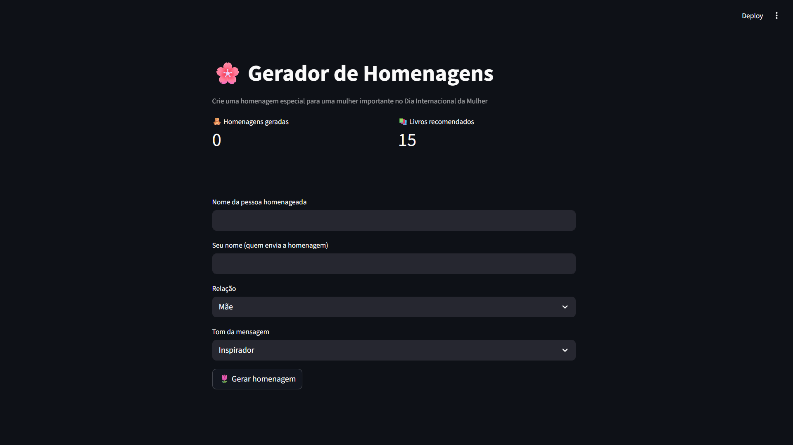
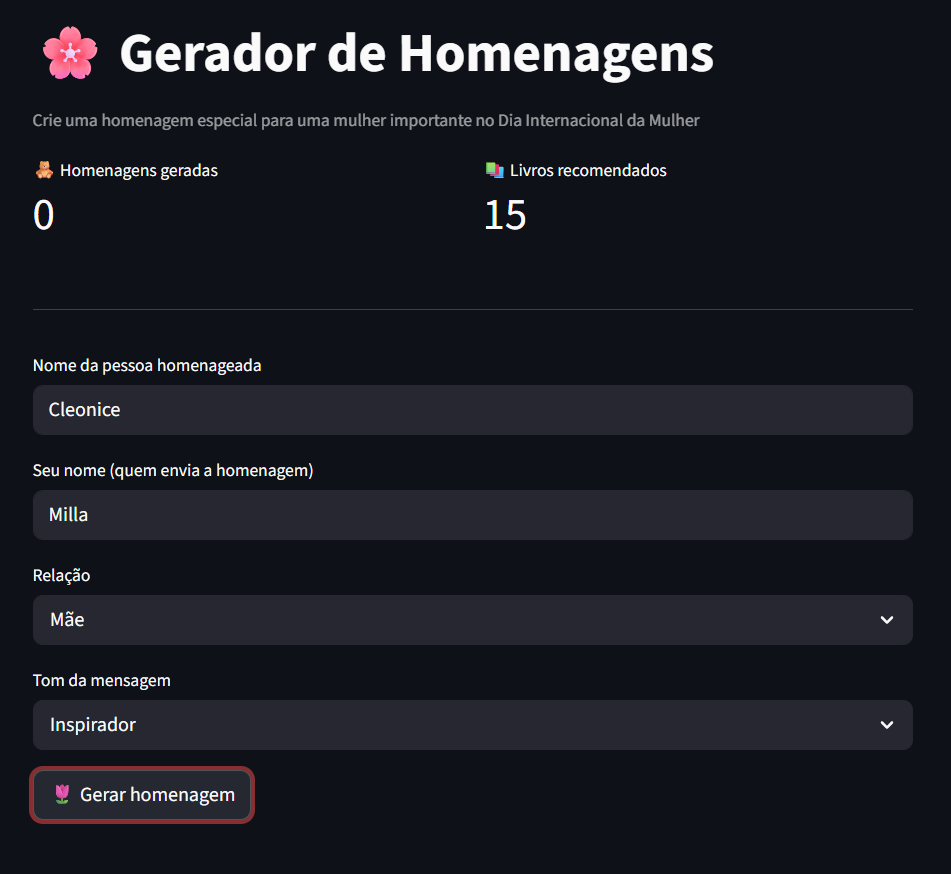

# Dia Internacional da Mulher - Gerador de Homenagens


## 📌 Sobre o Projeto

Este projeto foi desenvolvido durante o curso Microsoft Azure Cloud Native 2026, promovido pela Digital Innovation One.

A aplicação consiste em um gerador de homenagens para o Dia Internacional da Mulher, permitindo que o usuário crie mensagens personalizadas para mulheres importantes em sua vida.

Além da geração da mensagem, o sistema também recomenda livros escritos por autoras, acompanhados de uma frase inspiradora na obra.

O objetivo do projeto é demonstrar o desenvolvimento de uma aplicação web em Python, containerizada com Docker e publicada na nuvem utilizando serviços da Microsoft Azure, com acesso público via URL.

## Estrutura do Projeto

```
homenagem-mulheres
│
├── app.py                - Aplicação principal em Streamlit
├── livros.py             - Base de livros e função de recomendação
├── requirements.txt      - Dependências do projeto
├── Dockerfile            - Configuração do container Docker
├── script.ps1            - Registro dos comandos utilizados no deploy
└── img/                  - Capturas de tela da aplicação
```

## Screenshots

#### Página inicial da aplicação



#### Formulário preenchido



#### Resultado da homenagem gerada


## ▶️ Como Rodar o Projeto

Para rodar o projeto e reproduzir o deploy, foi utilizado:

* Terminal PowerShell no Visual Studio Code
* Extensão PowerShell no VS Code
* Azure CLI autenticado na conta da Microsoft Azure
* Docker Desktop

O passo a passo completo de build da imagem Docker, execução local, criação dos recursos na nuvem e publicação do container está documentado no arquivo `script.ps1`.

> Basta abrir o projeto no VS Code, garantir que o Azure CLI esteja logado (`az login`) e seguir os comandos registrados no `script.ps1`, substituindo os placeholders pelos seus próprios valores.

## Tecnologias utilizadas

| Tecnologia | Finalidade |
| --------- | --------- |
| Python | Desenvolvimento da aplicação |
| Streamlit | Interface web interativa |
| Docker | Containerização da aplicação |
| Microsoft Azure | Hospedagem da aplicação |
| Azure Container Registry | Armazenamento da imagem Docker |
| Azure Container Apps | Publicação do container com URL pública |

## 💡 Aprendizados

* Desenvolvimento de aplicações web com Python e Streamlit
* Containerização de aplicações com Docker
* Publicação de imagens no Azure Container Registry
* Deploy de aplicações web usando Azure Container Apps
* Criação de aplicações acessíveis publicamente na nuvem

## 👩‍💻 Autora

Milla Regina Lopes Vieira - [LinkedIn](https://www.linkedin.com/in/milla-regina-468020206/)"# homenagem-dia-das-mulheres" 
"# homenagem-dia-das-mulheres" 
